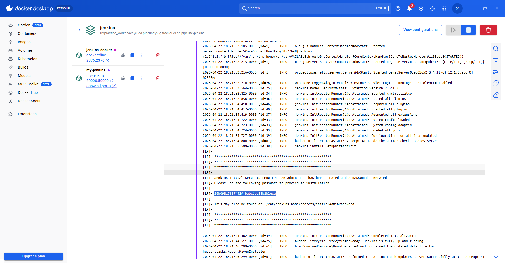

## Code Setup

1. Clone Repo: https://github.com/Kiranmoy/bug-tracker-ci-cd-pipeline
2. Install Docker Desktop (such as, via Microsoft Store)
3. Launch Docker Desktop and ensure docker is running.

## Set up & Running Jenkins Instance locally (via Docker Desktop)

Navigate to Dockerfile & docker-compose.yml

```
cd jenkins
```

Build Docker Image called my-jenkins

```
docker build -t my-jenkins .
```

Configure Jenkins Container via Docker Compose

```
docker compose up -d
```

Launch Jenkins

```
http://localhost:9000/
```

Unlock Jenkins with Admin Password

To ensure Jenkins is securely set up by the administrator, a password has been written to the logs in Docker Desktop Container and this file on the server:
```
/var/jenkins_home/secrets/initialAdminPassword
```



Install Suggested Plugin

## Create First Admin User

* Username: `admin`
* Password: `admin`
* Email: `admin@gmail.com`

## Jenkins URL

```
http://localhost:9000/
```


